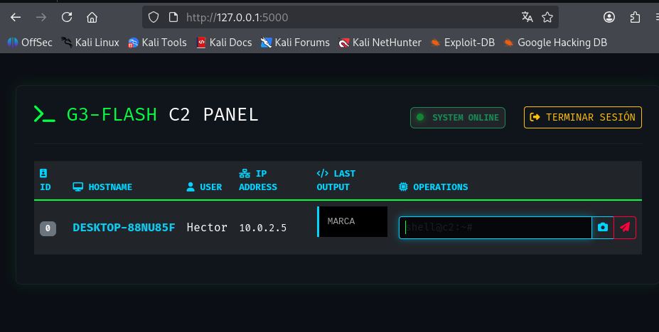
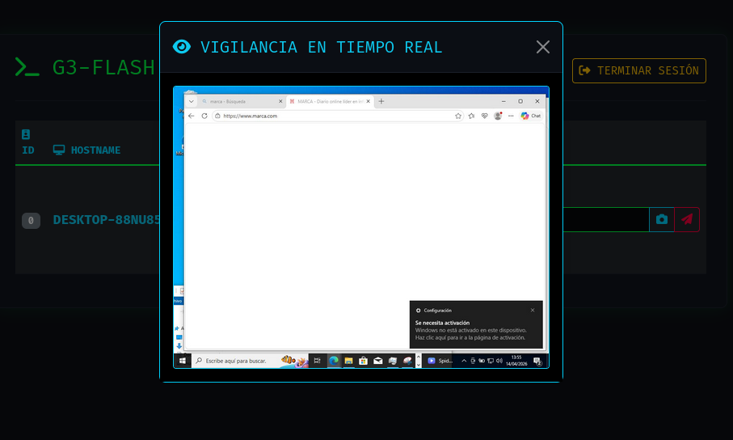
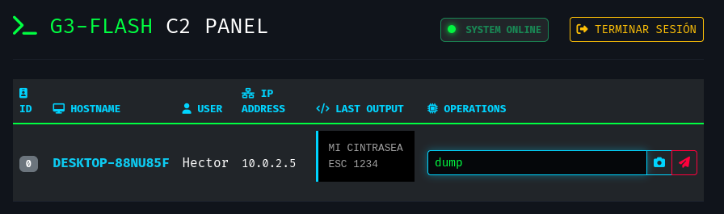

# 
⚡ G3-FLASH | Advanced C2 Framework ⚡

  
  
  
  

---

## 📸 Visual Proof (Demo)

### 🖥️ Main Dashboard

  
   <em>Interfaz principal con gestión de agentes en tiempo real.</em>

### 👁️ Live Surveillance (Screenshot Module)

  
   <em>Visor de capturas de pantalla integrando bypass de caché del navegador.</em>

### ⌨️ Keylogger Data Exfiltration

  
   <em>Resultado del comando 'dump' mostrando la recuperación de pulsaciones.</em>

---

## 📖 Descripción
**G3-FLASH** es una plataforma de Comando y Control (C2) de grado de investigación diseñada para demostrar la interacción compleja entre implantes de bajo nivel y servidores de control modernos.

---

## 🛠️ Arquitectura Técnica

### 🛡️ Agente (Implante C++ Native)
* **📸 Vigilancia por GDI+:** Captura de pantalla en tiempo real con sistema de bloqueo de ámbito.
* **⌨️ Keylogger Multihilo:** Basado en `SetWindowsHookEx` para captura asíncrona.
* **📂 Motor de Exfiltración:** Transmisión de archivos mediante buffers dinámicos de `std::vector`.

### 💻 Panel de Control (Python/Flask)
* **🔗 Sincronización de Sockets:** Lógica avanzada para manejar fragmentación de paquetes TCP.
* **📟 Dashboard Cyberpunk:** UI responsiva con Bootstrap 5 y estética Dark Terminal.

---

## 🚀 Guía de Despliegue

### 1. Compilación del Implante (Windows/MinGW)
\`\`\`bash
g++ main.cpp -o agente.exe -lws2_32 -ladvapi32 -lgdiplus -lgdi32 -mwindows -static -pthread
\`\`\`

### 2. Inicio del Servidor (Kali Linux)
\`\`\`bash
pip install flask
python3 web_server.py
\`\`\`

---

## ⚠️ Propósitos Educativos (Disclaimer)
Este software ha sido desarrollado con el único propósito de **educar** en ciberseguridad. El uso de esta herramienta en redes ajenas es **ilegal**.

---

  <b>Desarrollado por ramiactivated | 2026</b>

