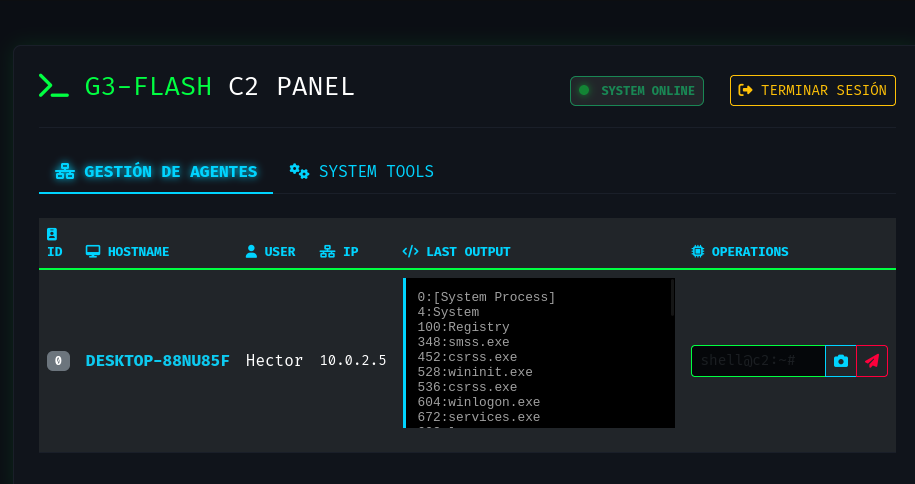

# <p align="center">⚡ G3-FLASH | Advanced C2 Framework ⚡</p>

<p align="center">
  
  
  
  
</p>

---

## 📸 Visual Proof (Demo)

### 🖥️ Tactical Dashboard & System Tools
<p align="center">
  
  <br><em>Panel actualizado con sistema de pestañas y módulo de gestión de procesos.</em>
</p>

### 👁️ Live Surveillance & Exfiltration
<p align="center">
  
  <br><em>Visor de capturas de pantalla y dump de keylogger integrado.</em>
</p>

---

## 📖 Descripción
**G3-FLASH** es una plataforma de Comando y Control (C2) de grado de investigación. Diseñada para demostrar la interacción compleja entre implantes de bajo nivel (WinAPI) y servidores de control modernos, permitiendo una administración total del host remoto.

---

## 🛠️ Arquitectura Técnica

### 🛡️ Agente (Implante C++ Native)
* **⚙️ System Tools Module:** Uso de `tlhelp32.h` para enumeración de procesos (`CreateToolhelp32Snapshot`) y terminación forzosa de tareas (`TerminateProcess`).
* **📸 Vigilancia GDI+:** Captura de pantalla en tiempo real con limpieza automática de buffers.
* **⌨️ Keylogger Multihilo:** Captura asíncrona basada en hooks globales de Windows.
* **📂 Transmisión de Archivos:** Gestión de sockets TCP para el envío de datos binarios fragmentados.

### 💻 Panel de Control (Python/Flask)
* **📑 Tabbed Interface:** Navegación dinámica entre gestión de agentes y herramientas de sistema.
* **🔗 Socket Sync:** Manejo de concurrencia y limpieza de datos para visualización en tiempo real.
* **📟 Estética Cyberpunk:** UI responsiva optimizada para operaciones rápidas.

---

## 🕹️ Comandos Disponibles

| Comando | Acción | Descripción |
| :--- | :--- | :--- |
| `ps` | **System** | Lista todos los procesos (PID y Nombre). |
| `kill [PID]` | **System** | Termina un proceso específico. |
| `screenshot` | **Surv** | Captura y descarga la pantalla actual. |
| `dump` | **Surv** | Descarga el registro de teclas acumulado. |
| `ls / cd / ...` | **Shell** | Ejecución de comandos directos en la CMD. |

---

## 🚀 Guía de Despliegue

### 1. Compilación del Implante (Windows)
```bash
g++ main.cpp -o agente.exe -lws2_32 -ladvapi32 -lgdiplus -lgdi32 -mwindows -static -pthread
